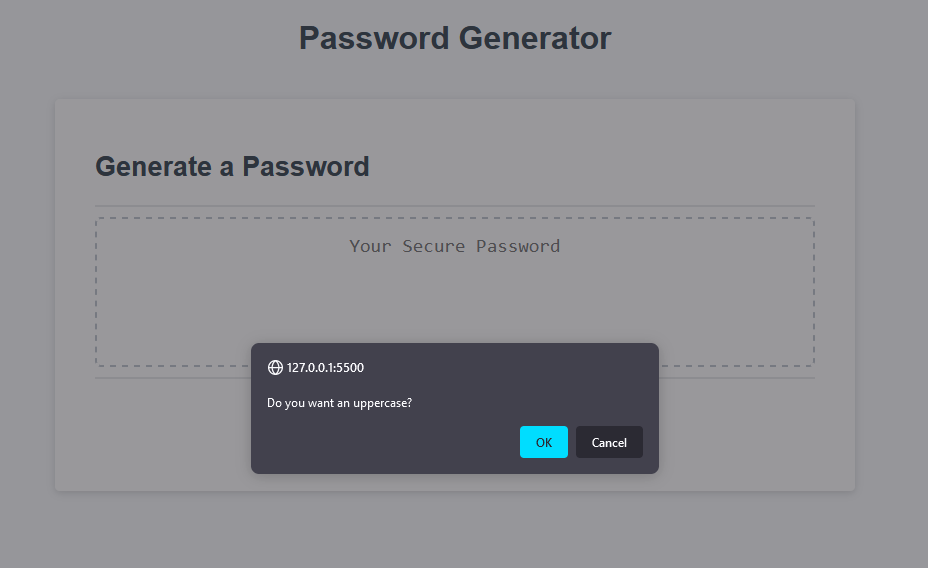
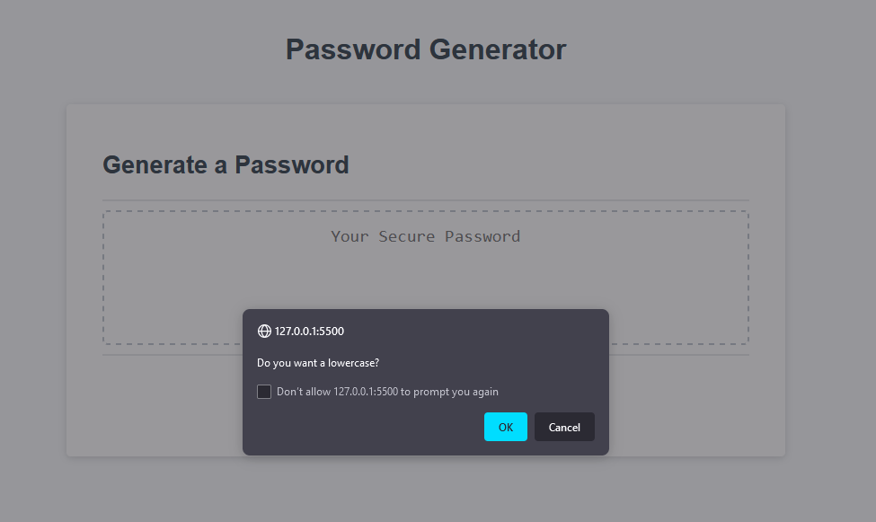
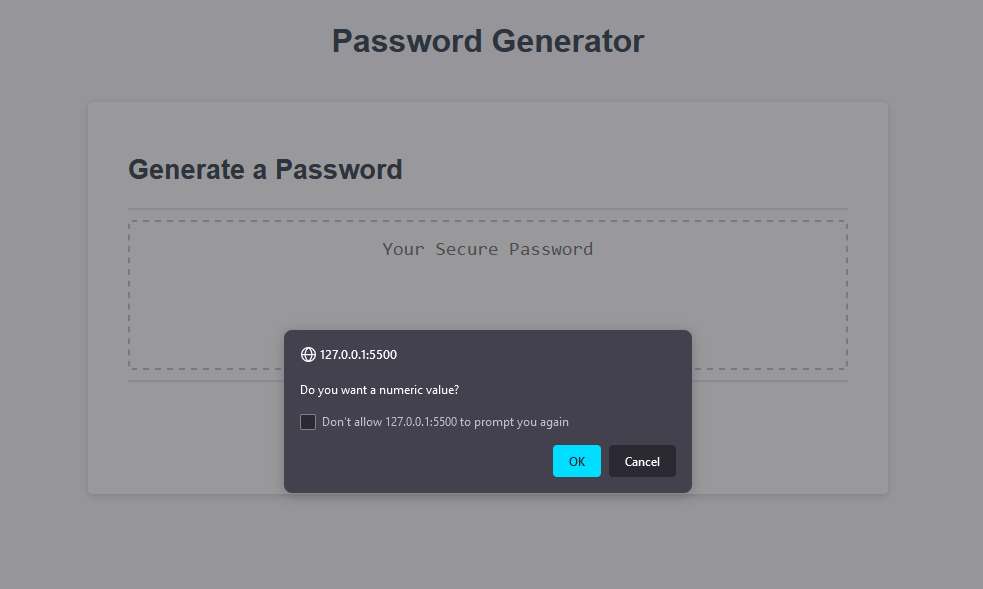
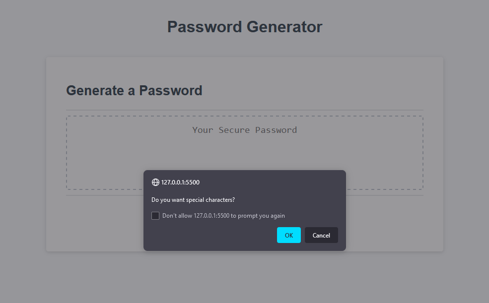
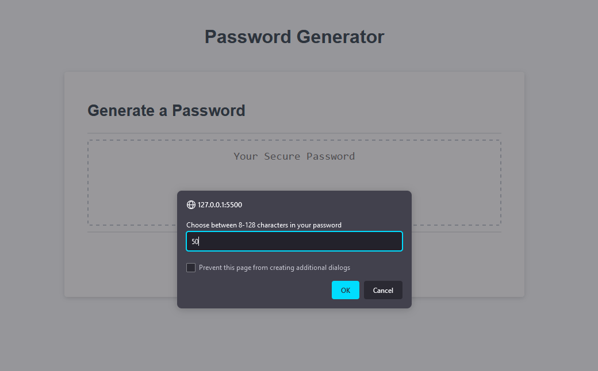
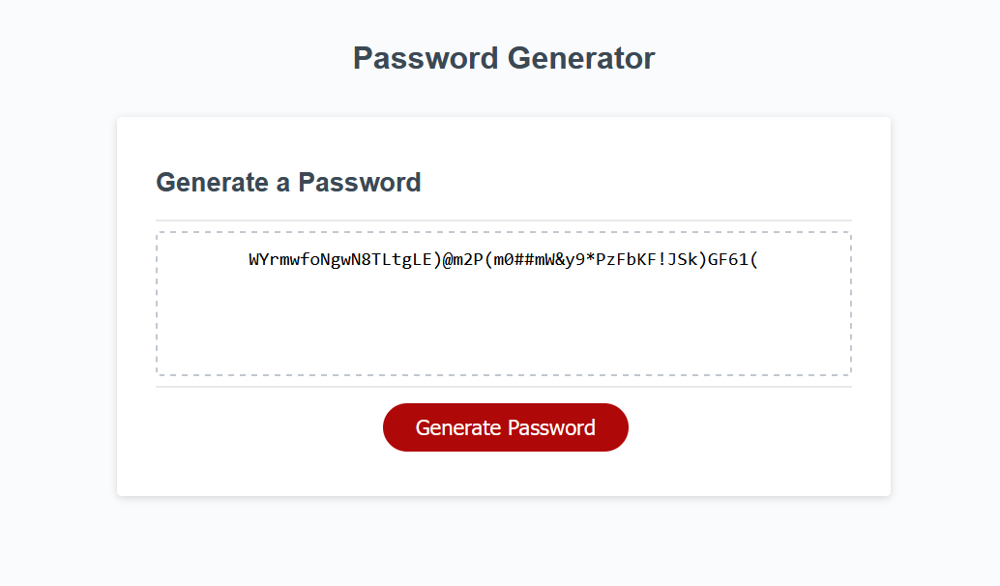

# Jayden's Random Password Generator

## Assignment Details

I have created 4 window pop-ups(booleans) to ask if user wants upper case and lowercase letters; also asking if user wants numeric values and symbols in their random generated password.
Then the use is prompt of how many characters they want in their password (between 8-128).
Once the questions have been answered, the logic will run and will generate and random password based on user choice.
I've also taken the time to clear the input field once the page is refreshed because it was not clearing before.

## Acceptance Criteria

```
GIVEN I need a new, secure password
WHEN I click the button to generate a password
THEN I am presented with a series of prompts for password criteria
WHEN prompted for password criteria
THEN I select which criteria to include in the password
WHEN prompted for the length of the password
THEN I choose a length of at least 8 characters and no more than 128 characters
WHEN asked for character types to include in the password
THEN I confirm whether or not to include lowercase, uppercase, numeric, and/or special characters
WHEN I answer each prompt
THEN my input should be validated and at least one character type should be selected
WHEN all prompts are answered
THEN a password is generated that matches the selected criteria
WHEN the password is generated
THEN the password is either displayed in an alert or written to the page
```

## Examples








